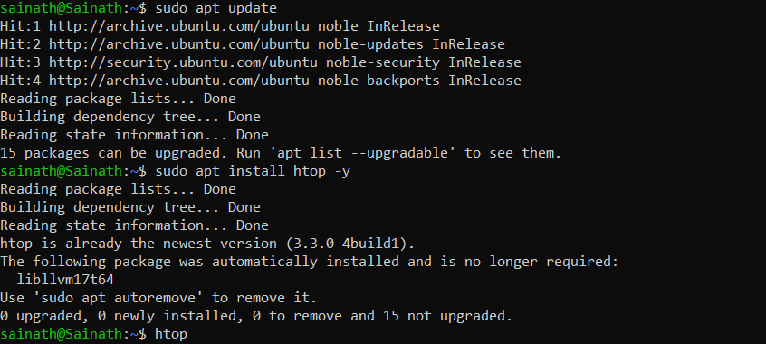
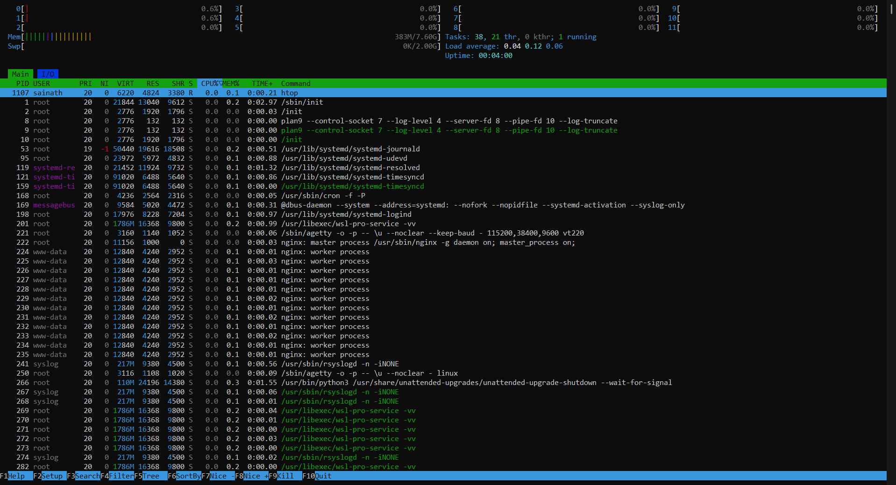
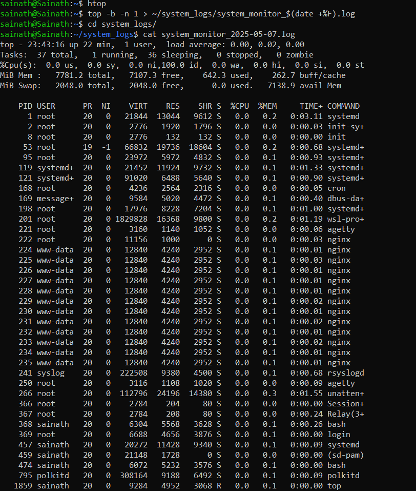
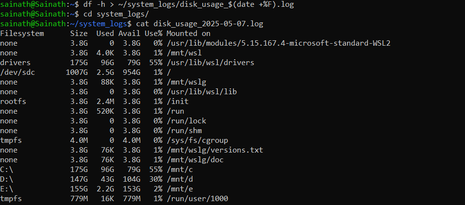
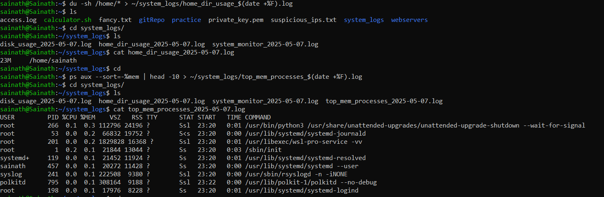
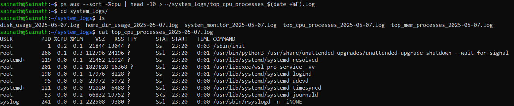
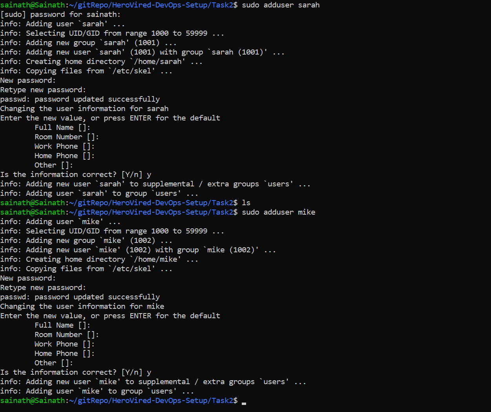
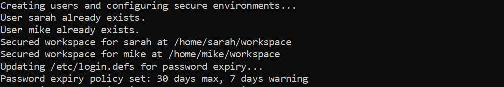
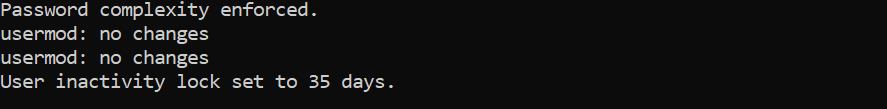
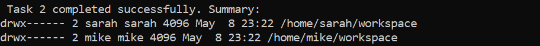

# HeroVired-DevOps-Setup

# Task 1: System Monitoring Setup

---

## Objective

Configure a monitoring system to track **CPU**, **memory**, **disk usage**, and **processes**. 
Ensure logs are saved for capacity planning and performance monitoring.

---

## Tools Used

- **htop**: Real-time process viewer.
- **df**: Disk space usage.
- **du**: Directory-level space usage.
- **ps/top**: Resource-intensive process tracking.
- **Bash script**: For automation and logging.

---

## Log File Structure

```
/system_log/
├── system_monitor_YYYY-MM-DD.log
├── disk_usage_YYYY-MM-DD.log
├── home_dir_usage_YYYY-MM-DD.log
├── top_mem_processes_YYYY-MM-DD.log
└── top_cpu_processes_YYYY-MM-DD.log

```

## Output

Run the script with: `./monitor.sh`

You’ll see log files generated under /system_log/ relative to the script.
Use ls to view them and cat <filename> to verify the content.

---



















# Task 2: User Management and Access Control

---

## Objective

Set up secure and isolated user environments for new developers **Sarah** and **Mike**.  
Ensure proper user creation, directory access control, password expiration, and complexity policies as per organizational security standards.

---

## Users and Workspaces

| Username | Workspace Directory         |
|----------|-----------------------------|
| sarah    | `/home/sarah/workspace`     |
| mike     | `/home/mike/workspace`      |

---

## Tasks Completed via Bash Script

### 1. Created users `sarah` and `mike` with default strong passwords

```bash
sudo adduser sarah
sudo adduser mike
```

### 2. Created private workspaces

``` bash
sudo mkdir -p /home/sarah/workspace
sudo mkdir -p /home/mike/workspace
```

### 3. Applied strict ownership and permissions

```bash
sudo chown sarah:sarah /home/sarah/workspace
sudo chmod 700 /home/sarah/workspace

sudo chown mike:mike /home/mike/workspace
sudo chmod 700 /home/mike/workspace
```
`chmod 700` ensures only the user can access their workspace.

### 4. Enforced password expiration policy

Modified `/etc/login.defs`:
```bash
PASS_MAX_DAYS   30
PASS_MIN_DAYS   0
PASS_WARN_AGE   7
```

### 5. Enforced password complexity policy

Installed and configured `libpam-pwquality`:
```bash
sudo apt install libpam-pwquality
```

Edited `/etc/pam.d/common-password` to include:
```bash
password requisite pam_pwquality.so retry=3 minlen=8 ucredit=-1 lcredit=-1 dcredit=-1 ocredit=-1
```

This enforces:

   - Minimum 8 characters
   - At least 1 uppercase, 1 lowercase, 1 digit, and 1 special character
   
### 6. Set account inactivity lock (35 days)

```bash
sudo usermod --inactive 35 sarah
sudo usermod --inactive 35 mike
```

---

## Output

### Workspace Permissions Verified:
```bash
sudo ls -ld /home/sarah/workspace
sudo ls -ld /home/mike/workspace
```

Expected output:

```bash
drwx------ 2 sarah sarah 4096 May 8 10:15 /home/sarah/workspace
drwx------ 2 mike  mike  4096 May 8 10:15 /home/mike/workspace
```

---











